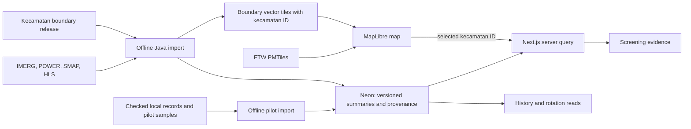

# Define the smallest technical architecture

Type: `grilling`  
Status: resolved  
Parent: [Field Shift Java decision map](../map.md)
Blocked by: 01, 02, 03, 04, 07

## Question

Given the tested data paths, crop history method, rotation computation, and pilot inputs, what is the smallest end-to-end architecture for Java-wide *kecamatan* screening and one later data-complete *kecamatan*? Decide what belongs in the existing Next.js app and PostgreSQL database, what needs offline geospatial processing, what can remain in source cloud storage, and which derived values need versioned provenance. Keep the later pilot map, time series, and rotation calculation connected through one checked zone identifier.

## Answer

Use the existing Next.js app, MapLibre, Neon PostgreSQL, and Drizzle. Publish Java-wide *kecamatan* screening as prepared map boundaries plus versioned summary rows. Run all raster and polygon joins in an operator-started import outside web requests. Keep checked farming-zone and plot evidence in a separate, later pilot path. No separate processing API or PostGIS query is required for the first release.

| Part | First-release responsibility |
| --- | --- |
| **Source storage** | Leave full NASA science files and FTW GeoParquet at their sources. Keep a reproducible source manifest and any small prepared inputs needed to audit an import. Serve prepared *kecamatan* boundary tiles and FTW PMTiles as static map assets. Tiles are display geometry, not the analysis record. |
| **Operator import** | Read a versioned *kecamatan* boundary release and source data. Join each NASA source at its native scale, check units and valid observations, calculate one row per *kecamatan*, indicator, and observation period, then stage a complete Java-wide revision. Publish it only after validation. A complete revision has an explicit available or unavailable status for each required indicator and area; it need not invent a numeric value where source coverage fails. |
| **Java-wide indicators** | IMERG supplies dated rainfall screening, POWER supplies dated heat and weather context, SMAP supplies area moisture context, and HLS supplies vegetation activity plus valid-image coverage. Use the most recent available observation period for each source, recorded separately. Do not combine those different dates into one current risk score or describe HLS activity as a crop name or checked crop cycle. |
| **Neon and Drizzle** | Store the boundary-release ID, *kecamatan* ID, revision ID, indicator, value or unavailable reason, unit, source period, coverage, quality, method version, and source-manifest reference. Index reads by published revision and *kecamatan* ID. A single current-revision pointer makes publication atomic. Use Drizzle migrations for the tables. No Java-wide polygon or raster join runs in PostgreSQL at request time. |
| **Next.js backend** | A feature-owned server query accepts a selected *kecamatan* ID and reads only the current published revision. It checks access before reading local pilot records. For the later data-complete area, a backend POWER path can fetch daily values on a source-cell cache miss and record its source period and time standard. The rotation module compares two plans against one fixed input snapshot and returns results with missing-input reasons. |
| **Map and views** | MapLibre selects a *kecamatan* from prepared boundary tiles and shows FTW outlines as separate predictions. Area screening reads the selected ID from Neon and shows each indicator's value, source, period, native scale, coverage, and status. A later checked farming zone has its own stable ID linked to its *kecamatan*; checked plot IDs anchor named crop history and plot comparisons. The zone ID remains the link across that pilot's map, history, and comparison views. |

**Provenance and quality:** each derived value points to a source product, collection and version, retrieval time, observation period, native cell or scene reference, unit, scale, coverage rule, and calculation version. Keep the source manifest for each published revision. Mark local crop events as checked observation, inference, or unknown. A fine FTW outline does not increase the precision of a coarse NASA cell. Show unavailable indicators and their reasons without hiding other valid indicators.

**Publication and failure rule:** validate the boundary IDs, expected *kecamatan* set, source manifests, units, coverage, and per-indicator status before switching the current-revision pointer. A failed import leaves the previous revision current. A user read stays on one revision. For the later pilot, use a valid POWER cache entry for the same source cell and period after a fetch failure; otherwise withhold only the affected water result.

**Feasibility gate:** the tested source paths prove small requests and catalog discovery, not a Java-wide HLS or SMAP run. Before calling the first release runnable, test authenticated pixel access, representative *kecamatan* coverage, processing time, and storage cost. The boundary source and stable IDs also need a verified release. These checks can change the import method without changing the published summary and tile interface.

**Deferred:** an automatic refresh schedule, a separate worker service, PostGIS request-time spatial queries, Java-wide named crop classification, AquaCrop execution, and plot-level recommendations outside a checked pilot. The path from operator import to a maintained service remains a later decision.

This revises the earlier one-zone architecture after [Define the working proof and checks](./06-working-proof.md). It follows the [pilot input contract](./04-pilot-input-contract.md) and [source access research](../../../docs/research/java-nasa-ftw-data-path.md). No partner data or full Java-wide import has been obtained or tested yet.
