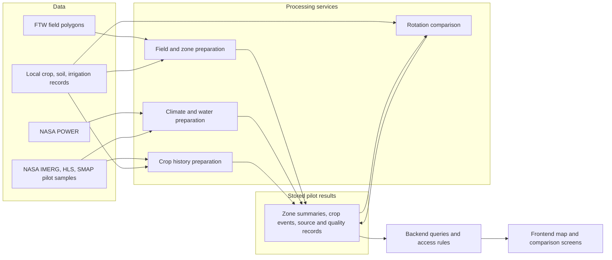
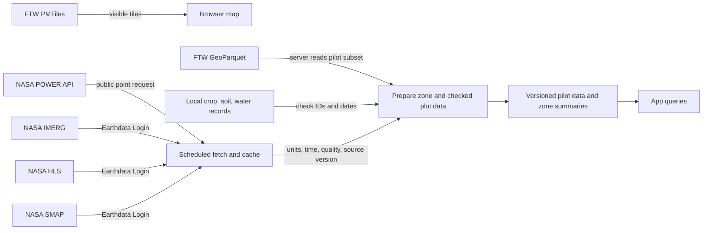
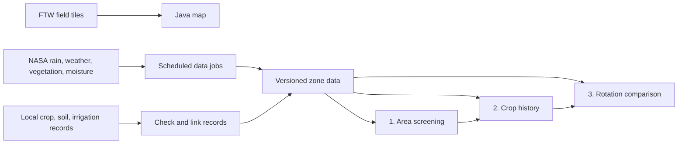
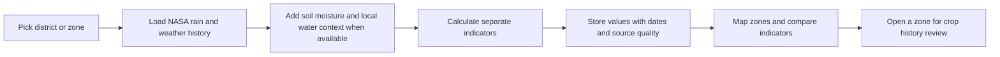
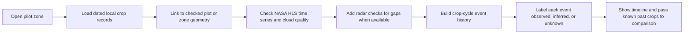

# Draft: Field Shift technology flow

**Status:** revised after user feedback, 26 September 2026. The main flow is **data → processing services → backend → frontend**. The target is one working pilot zone; the Java map gives wider context. The flows do not claim that a working model or local partner data already exists.

## Main system flow

**Processing services are logical jobs or modules.** The first proof does not need a separate deployed server for each one. Heavy raster and polygon work runs before a user request. The backend in the existing Next.js app reads prepared pilot results and runs or retrieves a small rotation comparison. The frontend uses the current MapLibre map and shows source dates and missing values. The [technical architecture decision](./issues/05-technical-architecture.md) uses Neon for versioned pilot records and manual imports for the first proof.

**Map tile path:** FTW PMTiles take a shorter route: FTW archive → PMTiles protocol adapter → MapLibre frontend. The archive supports HTTP byte ranges, so the browser requests visible tiles. The backend uses a checked FTW GeoParquet subset for analysis; map tiles do not serve as the analysis record. [FTW vector collection](https://source.coop/ftw/global-data/predictions/vectors) · [PMTiles adapter](https://github.com/protomaps/PMTiles/blob/main/js/README.md) · [tested access path](../../docs/research/java-nasa-ftw-data-path.md)

**Live request path:** frontend selects a zone → backend looks for cached POWER values for the source grid cell and date range → climate service calls the public POWER API on a cache miss → backend returns a prepared series. The cache avoids a fresh call for every nearby field, as POWER advises. IMERG, HLS, and SMAP use clearly dated pilot samples in this proof; their repeatable authenticated jobs are a later step. [POWER daily API](https://power.larc.nasa.gov/docs/services/api/temporal/daily/) · [NASA access checks](../../docs/research/java-nasa-ftw-data-path.md)

| Processing service | Takes from data | Produces for backend |
| --- | --- | --- |
| **Field and zone preparation** | FTW GeoParquet, chosen district or zone boundary, checked local plot IDs. | Pilot geometry, field confidence, area and links to verified plots. |
| **Climate and water preparation** | Live POWER values; dated IMERG rain and SMAP moisture samples; local BMKG or irrigation checks. | Zone weather series, rain and water indicators, source period and data quality. |
| **Crop history preparation** | Local crop logs; dated HLS sample and optional radar observations; checked plot geometry. | Crop-cycle events marked observed, inferred or unknown, with evidence and image gaps. |
| **Rotation comparison** | Candidate crop sequences; prepared climate values; known past crops; local soil and irrigation facts. | Calendar and water screening results for two plans, plus missing inputs and reasons. AquaCrop remains a later, locally tested model. |

The backend can serve three read views over these results: **area conditions**, **crop history**, and **rotation comparison**. Each view uses the same selected zone and source records. The frontend can link between views without repeating source downloads. [Crop history method](../../docs/research/java-crop-history-method.md) · [rotation engine method](../../docs/research/java-rotation-engine.md)

## Source data details

| Source service | Access and processing flow | Data passed to app | Missing or weak data |
| --- | --- | --- | --- |
| **FTW boundaries** | Add the PMTiles protocol adapter to MapLibre so it can read visible tiles by HTTP byte range. A server job reads a small Java pilot subset from the Indonesia GeoParquet, then checks selected polygons against local plot geometry. The Indonesia file is about 3.9 GB, so the browser does not load it. | Predicted field outline, area, year, confidence and checked link to a local plot when available. | Show low or missing confidence. Do not treat a polygon as a legal parcel or a stable crop-history ID. [FTW collection](https://source.coop/ftw/global-data/predictions/vectors) · [PMTiles MapLibre adapter](https://github.com/protomaps/PMTiles/blob/main/js/README.md) |
| **NASA POWER** | Request daily values for each needed native source cell, set the time standard, save the JSON response and units, then cache by cell and date range. The tested Java point request needs no login. | Temperature and other weather series for broad climate and crop-water calculations. | Mark a missing day or parameter. Do not repeat point requests for every nearby field. [POWER daily API](https://power.larc.nasa.gov/docs/services/api/temporal/daily/) |
| **NASA GPM IMERG** | Discover files through CMR. An authenticated server job reads a pilot-zone subset, converts rain to a common daily period, and stores the run and version. | Zone rainfall history and dry-period indicators. | Keep V07 Final history and recent Late data distinct. Final V07 stops in September 2025; a recent value is not from that Final run. [IMERG product](https://disc.gsfc.nasa.gov/datasets/GPM_3IMERGDF_07/summary?keywords=imerg) · [NASA transition note](https://gpm.nasa.gov/data/news/update-imerg-v08-transition-schedule-aug-2026) |
| **NASA HLS** | Discover scenes through public CMR STAC. An authenticated server job reads the pilot windows of 30 m cloud-optimized images, applies quality flags, and builds a time series for checked plots. | Clear vegetation observations and coverage counts to support crop-cycle timing. | Show cloud gaps and mixed or too-small plots. No crop name is confirmed by reflectance alone. [HLS guide](https://lpdaac.usgs.gov/documents/1698/HLS_User_Guide_V2.pdf) |
| **NASA SMAP L4** | Discover files through CMR. An authenticated job reads 9 km, 3-hourly HDF5 data, then stores daily or weekly zone summaries. | Area-level surface and root-zone wetness context. | Show missing or affected dates; never use this as a plot soil test. [SMAP product](https://nsidc.org/data/spl4smgp/versions/8) |
| **Local and Indonesian sources** | Import plot-linked crop and irrigation records from a pilot partner; attach soil tests with dates and methods. Read BPS and BMKG area data as checks. Record KATAM guidance as a comparison baseline. | Named crop history, irrigation facts, measured soil values and existing guidance. | A missing local record stays unknown. An aggregate BPS value does not label a field. [BPS census](https://sensus.bps.go.id/main/index/st2023) · [KATAM](https://jatim.brmp.pertanian.go.id/layanan/layanan-lainnya/kalender-tanam-terpadu-katam-terpadu-sc) |

The source access tests are in the [NASA and FTW data path report](../../docs/research/java-nasa-ftw-data-path.md). They prove small requests and catalog searches, not the speed or quality of a Java pilot run. The first technical test should measure actual tile rendering, pilot subset time, coverage, and failed or missing requests.

## What the frontend shows

### Shared path

The browser reads visible FTW tiles. A server job prepares small NASA and FTW subsets for analysis. Each stored value keeps its source, version, time, unit, geographic scale, and quality flag. NASA POWER has a tested public point request; IMERG, HLS, and SMAP science files need Earthdata access and a prepared job. [FTW and NASA access checks](../../docs/research/java-nasa-ftw-data-path.md)

### 1. Find areas that need support

**Inputs:** district or zone boundary; IMERG rain history, POWER temperature and radiation, optional SMAP moisture, BMKG checks and known irrigation context. **Computation:** dry-period frequency, rain variation by season, heat exposure, and missing-data coverage. The first proof shows separate indicators instead of one unexplained “risk” score. **Output:** a zone map with values, periods, and source links. **Failure path:** if a source has too little coverage or a known data issue, show “insufficient data” for that indicator. NASA grid values describe an area, not each FTW field. [NASA data research](../../docs/research/indonesia-agriculture-and-data.md) · [NASA access checks](../../docs/research/java-nasa-ftw-data-path.md)

### 2. Study past crop patterns

**Inputs:** local crop logs with dates and plot identifiers, checked geometry, NASA HLS vegetation observations, and optional Sentinel-1 radar. **Computation:** link crop events to a place, check timing against imagery, and record image gaps. **Output:** a crop sequence timeline with evidence for each event. **Failure path:** if local logs or clear pixels are missing, keep the crop name unknown; a “non-rice” signal does not become maize or soybean. The pilot must test crop labels on fields held out from model fitting. [Crop history research](../../docs/research/java-crop-history-method.md)

### 3. Compare rotation plans

**Inputs:** candidate rice, maize or soybean sequences; crop dates and duration; measured or checked soil facts; actual irrigation access; NASA rain and weather history; local agronomist rules. **Computation:** first use a clear crop-calendar and FAO-56 water screening calculation. **Output:** whether each plan fits known timing and water constraints, plus estimated water demand, rain exposure, and the evidence behind each result. **Failure path:** when required local soil or irrigation facts are missing, show an exploratory comparison with explicit gaps. A later, locally tested AquaCrop run may add yield and water scenarios. It cannot show measured soil-health gains from a proposed rotation. [Rotation engine research](../../docs/research/java-rotation-engine.md) · [KATAM service](https://jatim.brmp.pertanian.go.id/layanan/layanan-lainnya/kalender-tanam-terpadu-katam-terpadu-sc)

## Decisions still open

1. The [working proof ticket](./issues/06-working-proof.md) must set the runnable demo and pass or fail checks.
2. Later service planning must set an update schedule after the manually imported pilot.
