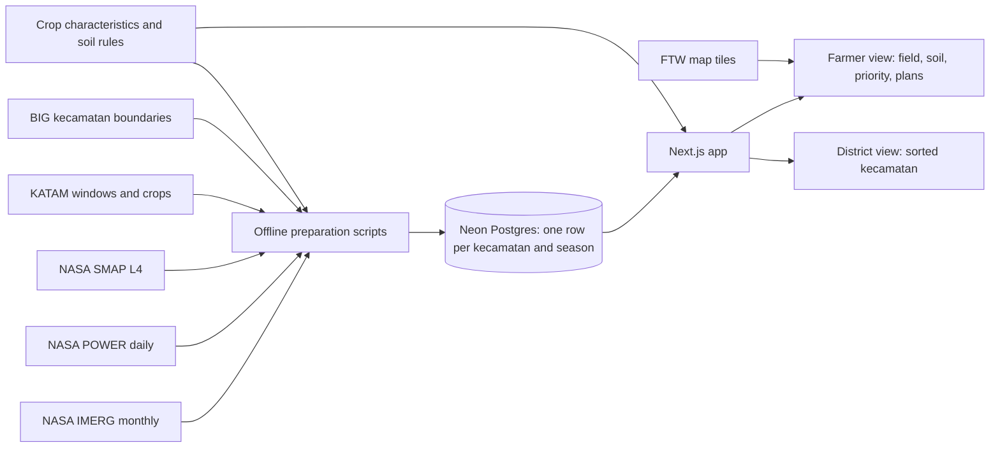

# PRD: Field Shift Java — crop rotation choices with NASA data

Status: Draft for review. Date: 30 September 2026.

This PRD targets the NASA Space Apps Challenge 2026 challenge [Field Shift: Adapting Farms with NASA Data](https://www.spaceappschallenge.org/2026/challenges/field-shift-adapting-farms-with-nasa-data/). The hackathon is on 14–15 November 2026. Judges score Impact, Creativity, Validity, Relevance, and Presentation. [Judging guide](https://spaceappschallenge.org/resources/judging-awards-guide)

The challenge asks for "a decision‑support tool that uses NASA Earth observations along with local soil information, crop characteristics, and farmer priorities to help farmers explore rotation strategies that could strengthen soil health and adapt their farms to changing conditions." Only the challenge summary is published now. Check this PRD again when the full challenge details and resources are published.

## 1. Executive Summary

### Problem Statement

Java farmers often plant rice in every season, including in dry seasons when rain is too low. This uses a lot of water and gives the soil no rest. Farmers and landowners do not have a simple way to compare other rotations against the rain and moisture in their own area.

### Proposed Solution

A mobile-first web tool. The farmer or landowner selects a field, picks a soil type and one priority, and then compares 3–4 rotation plans for the next three seasons. NASA rain, weather, and soil-moisture data give the reason for each plan. A secondary district view shows government staff which *kecamatan* have the largest dry-season water gap for rice. They can use it to plan rotation support.

### Confirmed scope

| Item | Decision |
| --- | --- |
| Main user | The farmer or landowner who decides what is planted. The owner may farm the land or rent it out. |
| Secondary user | District agriculture staff. They use one district view with the same evidence. |
| Launch area | All of Java, at *kecamatan* level. |
| Local inputs | Soil type and one priority. The user picks both. The tool does not ask for other plot facts. |
| Crops | Rice, maize, soybean, and fallow. These are the crops that KATAM covers. |
| Seasons | Wet season (MH, about Nov–Feb), first dry season (MK1, about Mar–Jun), second dry season (MK2, about Jul–Oct). Use the KATAM window for each area where available. |
| Stack | The current repo: Next.js in `apps/web`, and Neon Postgres (used by the probe scripts). |
| Deadline | The submission closes at the end of the hackathon on 15 November 2026. |
| Budget, team size | TBD. |

### Success Criteria

These targets are for the hackathon submission. They follow the judging criteria.

| # | KPI | Target | Judging criterion | How we measure |
| --- | --- | --- | --- | --- |
| 1 | Farmer task | At least 4 of 5 test users (farmers or landowners) choose a rotation plan without help in 3 minutes or less. | Impact | Timed test sessions before 14 November. We record the time and any help that we gave. |
| 2 | Farmer understanding | At least 4 of 5 test users can say, in their own words, why the plan they chose uses less water or helps the soil. | Impact, Validity | One question after the task. Two team members score the answer against the plan's evidence. |
| 3 | Java coverage | 100% of Java *kecamatan* in the boundary layer show plan results or an unavailable state with a reason. | Validity | A database check that counts every *kecamatan* by state. |
| 4 | Evidence tracing | 100% of numbers in a plan link to a source, period, and spatial scale. | Validity | An audit of the plan output template and 10 random *kecamatan*. |
| 5 | Challenge fit | The tool uses all four challenge inputs: NASA data, local soil, crop characteristics, and farmer priority. The output is a rotation over several seasons. | Relevance | A checklist review of the demo path. |

Secondary target: at least 1 extension worker (PPL) or district staff member finds the 10 *kecamatan* with the largest MK2 water gap in one province in 2 minutes or less.

Out of scope for these targets: yield, profit, and measured soil change. The hackathon cannot measure farm outcomes.

## 2. User Experience & Functionality

### User Personas

| User | Need | Decision the tool supports |
| --- | --- | --- |
| **Farmer or landowner** (main) | Protect income and land quality. Use water well. The owner may not farm the land. | Which rotation plan to follow, or to discuss with the tenant, for the next three seasons. |
| **District agriculture staff** (secondary) | Use limited seed, water, and extension support where it helps most. | Which *kecamatan* should get rotation support, such as legume seed or PPL visits, first. |

### User Flows

**Farmer or landowner:**
Open the tool → find the field (search a place, tap the map, or tap an FTW outline) → pick soil type → pick one priority → compare 3–4 rotation plans → open the evidence for a plan → choose a plan → save or share it.

**District staff:**
Open the district view → select a province or district → see *kecamatan* sorted by MK2 water gap for rice → open one *kecamatan* → see the same evidence and the plans that the farmer view shows.

### User Stories and Acceptance Criteria

#### F1. Find my field

**Story:** As a farmer or landowner, I want to find my field on a map so that the plans use the conditions in my area.

**Acceptance criteria:**

- The user can search a village or *kecamatan* name, tap a point on the map, or tap an FTW outline.
- The tool shows the *kecamatan* that contains the point.
- An FTW outline shows its prediction year and the label "predicted outline, not a legal boundary".
- The user can continue with a point when FTW has no outline.
- The flow works on a phone screen that is 360 px wide.

#### F2. Tell the tool about my soil and priority

**Story:** As a farmer or landowner, I want to give my soil type and my main priority so that the plans fit my field and my goal.

**Acceptance criteria:**

- Soil type choices: clay (*liat*), loam (*lempung*), sandy (*berpasir*), and "I do not know". Each choice has a short plain description to help the user.
- Priority choices: save water, improve soil, or keep rice production.
- If the user picks "I do not know", plans show the effect of each soil type, and the soil effect is marked as unresolved.
- Both inputs take 2 taps or fewer, and the user can change them at any time.
- The tool does not store these inputs unless the user saves a plan.

#### F3. Compare rotation plans

**Story:** As a farmer or landowner, I want to compare rotation plans side by side so that I can see the water and soil effect of each plan.

**Acceptance criteria:**

- The tool shows 3–4 plans for the next three seasons. Example plans: rice–rice–rice, rice–rice–soybean, rice–maize–soybean, rice–soybean–fallow.
- The tool always shows rice–rice–rice as the baseline.
- For each season in each plan, the tool shows:
  - Rain cover: the percentage of the crop's water need that normal rain in that season covers.
  - Soil note: for example, a legume adds nitrogen, or a third rice season in a row gives the soil no rest.
  - Soil fit: whether the crop suits the soil type that the user picked.
- The priority changes the order of the plans. It does not hide plans.
- Each plan shows which season has the largest water risk.
- The tool uses the words "plan to consider" and not "recommendation".
- Plans use only crops and windows that KATAM lists for the area. If KATAM has no entry for the area, the tool uses the default season dates and shows this.

#### F4. See why

**Story:** As a farmer or landowner, I want to see the evidence behind a plan so that I can decide how much to trust it.

**Acceptance criteria:**

- Each number opens a short text that gives the source, the period, and the spatial scale. For example: "IMERG, MK2 average 2001–2025, 10 km grid cell".
- The main view uses plain Bahasa Indonesia. Source names and technical details appear only when the user opens them.
- The evidence shows a current condition when data is available. For example: "Soil moisture now is lower than normal (SMAP, 28 October 2026)".
- Missing and low-coverage data have different states. Missing data is not shown as zero.

#### F5. Save or share my plan

**Story:** As a landowner, I want to save or share a plan so that I can discuss it with the person who farms my land.

**Acceptance criteria:**

- The user can save a plan in the browser without an account.
- The user can share a link or an image that shows the plan, the field, the soil type, the priority, and the source dates.
- The shared plan uses the label "plan to consider, not checked on your field".

#### G1. Find where rotation support helps most

**Story:** As district staff, I want to see which *kecamatan* have the largest dry-season water gap for rice so that I can plan rotation support.

**Acceptance criteria:**

- A map and a sorted list of *kecamatan* for a selected province or district.
- The sort measure is MK2 rain cover for rice. The tool shows its period and method.
- A *kecamatan* without valid data is marked unavailable and goes to the end of the list.
- *Kecamatan* that share one IMERG grid cell are marked as shared evidence.
- Opening a *kecamatan* shows the same plans and evidence as the farmer view.
- The view shows no data from single users. It has no saved farmer plans and no user locations.

### Experience Requirements

- Mobile first. The farmer flow must work on a mid-range Android phone. Device and network targets are TBD, and we must set them before the performance tests.
- The main language is Bahasa Indonesia. English is optional.
- Meaning must not depend only on color. Each rain-cover value shows a number and a text label.
- The user can do the core tasks with a keyboard or a screen reader, and with a list view instead of the map.

### Non-Goals

- Price, profit, or yield predictions. We have no price data. For this reason, "income" is not a priority choice.
- Irrigation water supply, fertilizer, or pest advice.
- A recommendation that is checked for one field. Plans are exploratory scenarios at area level.
- Soil tests, plot records, crop history, or land ownership.
- Crops other than rice, maize, and soybean in the MVP.
- User accounts, government saved lists, and export versioning.
- An AI chat assistant or new model training.
- Crop detection from HLS images.

## 3. AI System Requirements

The MVP uses no language model and trains no model. FTW uses machine learning to predict field outlines. The tool only shows the published FTW predictions.

The plan logic is a fixed set of rules. We can test it and explain it.

### Tool Requirements

- FTW global predictions (2025) as map tiles, with year and confidence.
- A crop characteristics table: the season length and the water need for each crop, based on FAO-56 crop coefficients. The table also gives the soil fit and the soil-health note for each crop. A named source supports each row.
- A rule table for soil fit. A named agronomy source supports each rule. A PPL or agronomist reviews the table before the demo, if possible.

### Evaluation Strategy

- **Rule tests:** At least 20 fixed cases, each with inputs and the expected rain cover, order, and notes. They include "I do not know" soil, missing KATAM data, and missing NASA data. All tests must pass before the demo.
- **Reasonableness check:** For 5 known *kecamatan*, a PPL, an agronomist, or published local guidance agrees that the water-risk season is correct. If nobody can review the check, the PRD records this.
- **FTW:** Show the prediction label and year. Do not describe FTW confidence as ownership or as boundary accuracy.

## 4. Technical Specifications

### Architecture Overview

- **Preparation happens before the demo.** Scripts compute a season summary for each *kecamatan*: normal rain, reference crop water use (ETo), and current soil moisture. Then they store the result in Neon. The app does not read NASA files at request time.
- **The app computes the plans at request time.** It combines the stored season summaries with the soil type, the priority, and the crop table. This is a pure function, and the rule tests cover it.
- **Rain cover** = normal season rain ÷ (crop coefficient × ETo for the season). ETo uses the Hargreaves method with POWER daily minimum and maximum temperature, because POWER solar values were missing in the probe.

### Integration Points

| Source | Use | Notes |
| --- | --- | --- |
| NASA IMERG Final monthly V07 | Normal rain per season, 2001–2025, for each *kecamatan* | The grid is 0.1°. Compute an area-weighted value for each *kecamatan*. Mark *kecamatan* that share one cell. Access needs an Earthdata token and GES DISC approval (tested). |
| NASA POWER daily | Minimum and maximum temperature for ETo | One request for each *kecamatan* centroid, cached. This is about 7,000 requests, so rate limits and run time need a test. |
| NASA SMAP L4 (SPL4SMGP) | Current root-zone moisture compared to normal | Latest available date. Show the date. The grid is about 9 km. |
| KATAM | Planting windows and crops for each *kecamatan* | Access is not verified. A dated manual import is acceptable if the terms allow it. If there is no KATAM entry, use the default seasons. |
| BIG *kecamatan* boundaries | The area unit for Java | Used in the probe. The license terms for reuse need a check. |
| FTW global predictions 2025 | Field outlines on the map | Map tiles only. No analysis on the outlines. |
| Crop table and soil rules | Plan logic | A static file in the repo, with a source for each row. |

**Soil data.** FTW does not give soil type. NASA SMAP gives moisture, not soil texture. For this reason, the user picks the soil type. Optional for v1.1: fill in a default soil type from ISRIC SoilGrids and let the user change it. SoilGrids is not NASA data. This is a scope decision.

### Security & Privacy

- No accounts in the MVP. Saved plans stay in the browser.
- A shared link contains only the location, the soil type, the priority, and the plan. Before the user shares a link, the tool tells the user that the link contains a location.
- The district view shows only area data. It never shows user locations or saved plans.
- Keep the NASA credentials on the preparation machine. Never send them to the browser or put them in the repo.
- Show the source attribution and licenses for NASA, FTW, BIG, and KATAM in the app.

## 5. Risks & Roadmap

### Phased Rollout

| Phase | Date | Scope | Exit criteria |
| --- | --- | --- | --- |
| Prep | Now to 13 Nov 2026 | Prepare the data for all of Java. Write the crop table and rule tests. Test the flow with farmers. | KPI 3 passes. Rule tests pass. At least 5 test sessions are complete. We confirm the Space Apps rules on work done before the event. |
| MVP | 14–15 Nov 2026 | Farmer flow F1–F5 and district view G1. Demo video and project page. | All five KPIs are met or reported honestly. The submission is complete. |
| v1.1 | Dec 2026 – Jan 2027 | Add inputs for last season's crop and water source (irrigated or rain-fed). Add an optional SoilGrids default. Test with more farmers. | At least 20 test users. The KPI 1 and 2 targets still pass. |
| v2.0 | 2027 | A local agronomist reviews the plans. Add more crops. Add price data if a reliable source exists. | An agronomist approves the plans in a pilot district. |

### Technical and Product Risks

| Risk | Effect | Response |
| --- | --- | --- |
| Space Apps rules limit work done before the event | Prep work may not count. | Read the rules now. If the rules limit it, keep prep to data and research, and build the app during the event. |
| KATAM access fails | Plans cannot use the local windows and crops. | Use the default seasons and show this. Try a dated manual import. |
| Data preparation for all of Java takes too long | KPI 3 fails. | Run the preparation by province, starting now. Show "unavailable" for *kecamatan* that are not done. |
| Irrigation is unknown | Rain cover can look bad for irrigated rice. | Label rain cover as "rain only". Add the water source input in v1.1. |
| The crop table or soil rules are wrong | The plans mislead users. | Give a source for each row. Ask a PPL or agronomist to review. The rule tests fix the expected output. |
| A 10 km rain cell looks like field data | Users trust the numbers too much. | Show the scale in the evidence. Mark shared cells. Use "your area" and not "your field". |
| We cannot find 5 farmers to test before the event | KPIs 1 and 2 have no evidence. | Start recruiting now, through family, PPL contacts, or farmer groups. Remote video sessions are acceptable. |
| POWER rate limits | Preparation stops. | Cache every response. Add a delay between requests. Continue from the last completed *kecamatan*. |

### Open Decisions

1. Confirm the Space Apps rules on work done before 14 November.
2. Confirm the KATAM access path.
3. Approve the crop list, the three plan sets, and the named sources for the crop table.
4. Decide whether SoilGrids can be an optional fourth data source in v1.1.
5. Set the team size, the phone, and the network targets.
