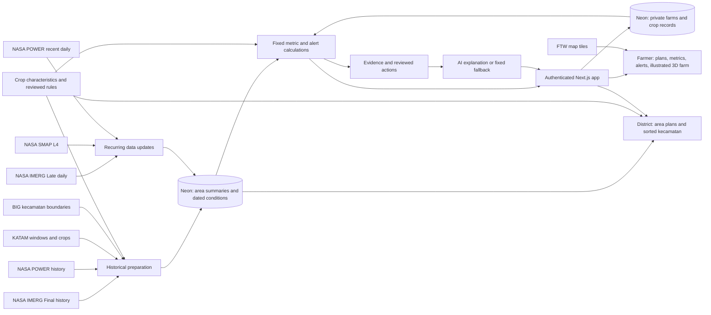

# PRD: Field Shift Java — crop rotation and farm monitoring with NASA data

Status: Agreed product scope; implementation checks remain open. Date: 30 September 2026. Data resource review: 1 October 2026. Monitoring scope agreed: 2 October 2026.

This PRD targets the NASA Space Apps Challenge 2026 challenge [Field Shift: Adapting Farms with NASA Data](https://www.spaceappschallenge.org/2026/challenges/field-shift-adapting-farms-with-nasa-data/). The hackathon is on 14–15 November 2026. Judges score Impact, Creativity, Validity, Relevance, and Presentation. [Judging guide](https://spaceappschallenge.org/resources/judging-awards-guide)

The challenge asks for "a decision‑support tool that uses NASA Earth observations along with local soil information, crop characteristics, and farmer priorities to help farmers explore rotation strategies that could strengthen soil health and adapt their farms to changing conditions." Only the challenge summary is published now. Check this PRD again when the full challenge details and resources are published.

## 1. Executive Summary

### Problem Statement

Java farmers often plant rice in every season, including in dry seasons when rain is too low. This uses a lot of water and gives the soil no rest. Farmers and landowners do not have a simple way to compare other rotations against the rain and moisture in their own area.

### Proposed Solution

A mobile-first web tool for signed-in farmers and landowners. They find or draw a field, record soil, crop, and planting date, save the farm in the database, and compare 3–4 rotation plans for the next three seasons. A farm view shows six metric cards, in-app alerts with AI explanations, and an illustrated 3D farm that responds to dated NASA conditions. A secondary district view helps agriculture staff find *kecamatan* with the lowest dry-season rain-to-crop-demand ratio for rice.

### Confirmed scope

| Item | Decision |
| --- | --- |
| Main user | The farmer or landowner who decides what is planted. The owner may farm the land or rent it out. |
| Secondary user | District agriculture staff. They use one district view with the same evidence. |
| Launch area | All of Java, at *kecamatan* level. |
| Local inputs | Soil type, current crop, and planting date. Date choices: exact, roughly this week/month, or unknown. The user picks one priority after saving the farm. |
| Access and storage | All app views require sign-in. Farms and crop records belong to the signed-in user and stay in Neon. The selected plan can be saved in the browser or shared. |
| Field selection | Place search, map point, FTW outline, or a drawn outline. A saved outline does not make NASA evidence field-level. |
| Monitoring | Three condition-alert families: dry conditions, heavy recent rain, and low area root-zone moisture. In-app alerts only. |
| Metric cards | Crop progress, recent rain, area soil moisture, recent temperature, estimated crop water demand, and rotation comparison. |
| Farm illustration | Illustrated 3D farm based on the saved field and crop records. Weather appearance uses dated area conditions. A 2D summary provides the same information. |
| AI | Explain checked signals and suggest actions from reviewed guidance. Fixed rules calculate metrics, rank plans, and trigger alerts. |
| Crops | Rice, maize, soybean, and fallow. KATAM supplies local windows for the three crops where available; fallow is a planned rest period. |
| Seasons | Wet season (MH, about Nov–Feb), first dry season (MK1, about Mar–Jun), second dry season (MK2, about Jul–Oct). Use the KATAM window for each area where available. |
| Stack | The current repo: Next.js in `apps/web`, and Neon Postgres (used by the probe scripts). |
| Deadline | The submission closes at the end of the hackathon on 15 November 2026. |
| Budget, team size | TBD. |

### Success Criteria

These targets are for the hackathon submission. They follow the judging criteria.

| # | KPI | Target | Judging criterion | How we measure |
| --- | --- | --- | --- | --- |
| 1 | Farmer task | At least 4 of 5 signed-in test users (farmers or landowners) save a farm and choose a rotation plan without help in 3 minutes or less. | Impact | Timed sessions within the permitted work period. Start from the signed-in farmer view. Record the time and any help that we gave. |
| 2 | Farmer understanding | At least 4 of 5 test users can say, in their own words, why the plan has lower estimated crop water demand or a stated soil benefit. | Impact, Validity | One question after the task. Two team members score the answer against the plan's evidence. |
| 3 | Java coverage | 100% of Java *kecamatan* in the boundary layer show plan results or an unavailable state with a reason. | Validity | A database check that counts every *kecamatan* by state. |
| 4 | Evidence tracing | 100% of numbers in plans, metrics, and alerts link to a source or farmer record, period, spatial scale where relevant, and calculation method. | Validity | An audit of plan, metric, and alert templates, including 10 random *kecamatan*, rough dates, and unavailable data. |
| 5 | Challenge fit | The tool uses all four challenge inputs: NASA data, local soil, crop characteristics, and farmer priority. The output is a rotation over several seasons. | Relevance | A checklist review of the demo path. |

Secondary targets:

- At least 1 extension worker (PPL) or district staff member finds the 10 *kecamatan* with the lowest MK2 rain-to-crop-demand ratio for rice in one province in 2 minutes or less.
- All monitoring release checks in Section 3 pass, including farm access, date uncertainty, alert repeats, stale data, and AI fallback.

Out of scope for these targets: yield, profit, and measured soil change. The hackathon cannot measure farm outcomes.

## 2. User Experience & Functionality

### User Personas

| User | Need | Decision the tool supports |
| --- | --- | --- |
| **Farmer or landowner** (main) | Protect income and land quality. Use water well. The owner may not farm the land. | Which rotation plan to follow, or to discuss with the tenant, for the next three seasons. |
| **District agriculture staff** (secondary) | Use limited seed, water, and extension support where it helps most. | Which *kecamatan* should get rotation support, such as legume seed or PPL visits, first. |

### User Flows

**Farmer or landowner:**

1. Sign in.
2. Find the field through place search or the map, select an FTW outline, or draw an outline.
3. Pick soil type, or "I do not know." Record the current crop and an exact, rough, or unknown planting date.
4. Save the farm to the database.
5. Pick one priority: save water, improve soil, or keep rice production.
6. Compare 3–4 rotation plans for the next three seasons.
7. Open a plan's evidence to see sources, dates, methods, and data limits.
8. Choose a plan, then save it in the browser or share it.
9. Return to the saved farm to read in-app alerts and AI insights.
10. See the six metric cards and the illustrated 3D farm. Update crop or harvest records when conditions change.

Monitoring continues after setup. Users can open metrics or alerts without repeating plan selection. A selected plan and an actual planted crop are separate records.

**District staff:**
Sign in → open the district view → select a province or district → see *kecamatan* sorted by MK2 rain-to-crop-demand ratio for rice → open one *kecamatan* → see the same area evidence and rotation plans that the farmer view shows.

### User Stories and Acceptance Criteria

#### F1. Find my field

**Story:** As a farmer or landowner, I want to find my field on a map so that the plans use the conditions in my area.

**Acceptance criteria:**

- The user can search a village or *kecamatan* name, tap a point on the map, select an FTW outline, or draw an outline.
- The user can edit or cancel a drawing. The tool accepts only a valid, closed outline with no self-intersection.
- A point within a selected or drawn outline identifies its reference *kecamatan*. If the outline crosses *kecamatan* limits, the tool states which area supplies the evidence. The outline is for saving and illustration; NASA values retain their native scale.
- The tool shows the *kecamatan* that contains the point.
- An FTW outline shows its prediction year and the label "predicted outline, not a legal boundary".
- The user can continue with a point when FTW has no outline.
- The flow works on a phone screen that is 360 px wide.

#### F2. Record my soil, crop, and planting date

**Story:** As a farmer or landowner, I want to record my soil, current crop, and planting date so that monitoring uses the facts I know about my farm.

**Acceptance criteria:**

- Soil type choices: clay (*liat*), loam (*lempung*), sandy (*berpasir*), and "I do not know". Each choice has a short plain description to help the user.
- Current crop choices: rice, maize, soybean, or fallow/no crop. A planned rotation does not set this record automatically.
- Planting date choices: exact date, roughly this week, roughly this month, or "I do not know." A week or month choice also permits another past week or month. Store the date range and precision.
- A fallow/empty field needs no planting date. A crop record describes actual planting; future dates belong to the plan.
- An exact date gives elapsed days. A rough date gives an elapsed-time range. An unknown date gives no date-based growth-stage estimate. Never replace a rough date with its middle day.
- Crop and planting date can be corrected. Confirmed harvest and growth-stage updates stay separate from estimates.
- If the user picks "I do not know" for soil, plans show the effect of each soil type, and the soil effect is marked as unresolved.
- Soil and crop choices each take 2 taps or fewer. Date-entry performance is included in the user task test.
- These inputs are stored when the farm is saved, before the user picks a priority.

#### F3. Save and reopen my farm

**Story:** As a farmer or landowner, I want to save my farm so that I can return to its records, metrics, and alerts.

**Acceptance criteria:**

- Sign-in is required before the farmer flow and for every private farm read or write.
- Saving stores the field point or outline, reference *kecamatan*, soil choice, crop record, planting-date precision/range, and user identifier.
- A saved farm can be reopened from the user's farm list on another signed-in device.
- A failed save shows an error and keeps the entered values for retry. Retrying does not create a duplicate farm.
- The user can edit or delete their own farm. Another signed-in user cannot read or change it by guessing its identifier.
- After saving, the user picks one priority: save water, improve soil, or keep rice production. They can change the priority during comparison.

#### F4. Compare rotation plans

**Story:** As a farmer or landowner, I want to compare rotation plans side by side so that I can see the water and soil effect of each plan.

**Acceptance criteria:**

- The tool shows 3–4 plans for the next three seasons. Example plans: rice–rice–rice, rice–rice–soybean, rice–maize–soybean, rice–soybean–fallow.
- The tool always shows rice–rice–rice as the baseline.
- For each season in each plan, the tool shows:
  - Rain-to-crop-demand ratio: normal season rain divided by estimated crop evapotranspiration. Show it as a percentage with its screening limits. It is not usable rain coverage or full irrigation need.
  - Estimated crop evapotranspiration in mm/season, and the plan's estimated demand difference from rice–rice–rice. It is not measured water saved.
  - Soil note: for example, a legume adds nitrogen, or a third rice season in a row gives the soil no rest.
  - Soil fit: whether the crop suits the soil type that the user picked.
- The priority changes the order of the plans. It does not hide plans.
- Each plan shows which season has the largest water risk.
- The tool uses the words "plan to consider" and not "recommendation".
- Plans use only crops and windows that KATAM lists for the area. If KATAM has no entry for the area, the tool uses the default season dates and shows this.

#### F5. See why

**Story:** As a farmer or landowner, I want to see the evidence behind a plan so that I can decide how much to trust it.

**Acceptance criteria:**

- Each number opens a short text that gives the source, the period, and the spatial scale. For example: "IMERG Final V07, MK2 average 2001–2024, 10 km grid cell".
- The main view uses plain Bahasa Indonesia. Source names and technical details appear only when the user opens them.
- The evidence shows the latest valid dated condition when data is available. For example: "Area soil moisture was lower than normal in the latest valid reading (SMAP, 28 October 2026)".
- Missing, old, and low-coverage data have different states. Missing data is not shown as zero.
- Evidence distinguishes farmer records, satellite estimates, model estimates, and calculations. Each derived value states its method and normal-reference period.

#### F6. Save or share my plan

**Story:** As a landowner, I want to save or share a plan so that I can discuss it with the person who farms my land.

**Acceptance criteria:**

- A signed-in user can save the chosen plan in the browser. Saving a farm in the database does not mark a plan as planted or selected.
- The user can share a link or an image that shows the plan, the field, the soil type, the priority, and the source dates.
- A shared link requires sign-in and gives read-only access to the shared plan snapshot. It does not grant access to private farm records, metrics, or alerts. The user can revoke the link.
- The shared plan uses the label "plan to consider, not checked on your field".

#### F7. Read alerts and AI insights

**Story:** As a farmer or landowner, I want to know when area conditions change so that I can check my farm and review upcoming work.

**Acceptance criteria:**

- The first version supports three condition families: dry conditions from low rain or a long dry spell, heavy recent rain, and low area root-zone moisture.
- IMERG Late daily supports recent rain and dry spells. SMAP L4 supports area moisture. The full options and source limits are in [the alert research](research/nasa-farm-alert-options.md).
- Alerts appear inside the app. They describe dated recent conditions. They are not forecasts, push notifications, or an emergency warning service.
- Fixed rules define the baseline, threshold, persistence, valid coverage, freshness, and recovery for each family. These rules must pass checks before release. The AI cannot choose or invent thresholds.
- Overlapping low-rain and low-moisture signals produce one dry-condition insight with dated evidence. They are not presented as independent confirmation of field drought.
- Each alert shows what changed, observation dates, area scale, supporting metrics, and an action from reviewed guidance. Initial actions ask for a field check or a review of a future planting decision.
- AI receives only checked evidence and approved actions. It cannot invent a cause, a forecast, measured damage, or an irrigation quantity. A fixed text explanation works if AI is unavailable.
- The tool records first detection, updates, acknowledgement, and recovery. It does not create a new copy of the same alert on every data refresh.
- Missing, old, or invalid evidence suppresses unsupported condition claims and shows a data-status notice.
- Crop-check reminders and optional requests to update unknown records are separate from weather alerts. A rough date gives a possible stage range; an unknown date cannot trigger an exact stage reminder.

#### F8. See my farm metrics

**Story:** As a farmer or landowner, I want to see crop progress and area conditions so that I can understand changes and compare plans.

**Acceptance criteria:**

- The saved farm has these six cards. Details and later options are in [the metric research](research/nasa-farm-metric-options.md).

| Card | First-version contents | Limit |
| --- | --- | --- |
| Crop progress | Recorded crop, date precision, elapsed days/range, recorded stage or harvest status | Growth stage is an estimate only when sourced crop rules support it. Unknown planting date gives no date-based stage. |
| Recent rain | Complete 7-/30-day totals in mm, comparison with the same-period normal, dry-spell detail when daily coverage is valid | Area rain estimate. Missing days do not count as dry days. |
| Area soil moisture | Root-zone moisture compared with the same-season normal and a recent trend | 9 km model estimate, not a field sample or soil-health measure. |
| Recent temperature | Recent maximum temperature and comparison with normal | Broad area estimate with observation dates, not live field temperature. |
| Estimated crop water demand | Estimated crop evapotranspiration with method and crop/date assumptions | Rough dates give a range where the method supports it. Unknown dates suppress stage-specific estimates. Fallow does not use a crop coefficient. |
| Rotation comparison | Seasonal rain-to-crop-demand ratios, estimated demand difference from continuous rice, soil fit, and crop sequence | Scenario comparison, not measured water saved, soil improvement, or irrigation supply. |

- Each number opens its source or farmer record, period, units, native scale where relevant, method, and quality limits.
- A farm with incomplete inputs or data still shows all card names with explicit unavailable or unresolved states.

#### F9. See an illustrated farm

**Story:** As a farmer or landowner, I want an illustrated 3D view of my saved farm so that I can explore crop progress and area conditions in a fun way.

**Acceptance criteria:**

- Use the saved point or outline and actual crop records. A point-only farm uses a labelled illustrative footprint with no claimed area.
- Show an estimated growth range only when crop rules and planting-date precision support it. Farmer-confirmed stages remain distinct from estimated stages.
- Dated rain, area moisture, and temperature can change the illustration. The scene shows source dates and a label that it is an illustration of area conditions.
- Do not display delayed rain as live rainfall or illustrated damage as measured crop damage. Missing data has an explicit unknown state.
- The six cards and alerts remain available in a 2D view when 3D is disabled or fails to load. The 3D view is not required to finish a core task.
- Support reduced motion and keyboard access to controls. Test the illustration on the agreed Android device and network before release.

#### G1. Find where rotation support helps most

**Story:** As district staff, I want to see which *kecamatan* have the lowest dry-season rain-to-crop-demand ratio for rice so that I can plan rotation support.

**Acceptance criteria:**

- A map and a sorted list of *kecamatan* for a selected province or district.
- The sort measure is MK2 rain-to-crop-demand ratio for rice, lowest first. The tool shows its period, method, and screening limits.
- A *kecamatan* without valid data is marked unavailable and goes to the end of the list.
- *Kecamatan* that share one IMERG grid cell are marked as shared evidence.
- Opening a *kecamatan* shows the same plans and evidence as the farmer view.
- The view shows no data from single users. It has no saved farmer plans and no user locations.

### Experience Requirements

- Mobile first. The farmer flow must work on a mid-range Android phone. Device and network targets are TBD, and we must set them before the performance tests.
- The main language is Bahasa Indonesia. English is optional.
- Meaning must not depend only on color. Each rain-to-crop-demand ratio shows a number and a text label.
- The user can do the core tasks with a keyboard or a screen reader, and with a list view instead of the map.

### Non-Goals

- Price, profit, or yield predictions. We have no price data. For this reason, "income" is not a priority choice.
- Irrigation water supply, fertilizer, or pest advice.
- A recommendation that is checked for one field. Plans are exploratory scenarios at area level.
- Soil tests, legal land ownership, and crop-history detection from satellite images. Basic farmer-reported crop and planting records are in scope.
- Crops other than rice, maize, and soybean in the MVP.
- Government saved lists, export versioning, and shared farm editing.
- An open-ended AI chat assistant or new model training. AI explanations of checked signals are in scope.
- Push, email, SMS, or WhatsApp alerts; forecast warnings; crop-specific heat alerts; vegetation, flood, fire, smoke, and landslide monitoring in the MVP. These need later checks.
- A measured 3D model, live field weather, or satellite-confirmed crop damage.
- Crop detection from HLS images.

## 3. AI System Requirements

The MVP uses a language model to explain checked monitoring signals and suggest actions from reviewed guidance. It trains no model. FTW supplies published predicted field outlines.

Fixed functions calculate metrics, rank rotation plans, and detect alert conditions. The language model does not calculate source values, choose thresholds, or change the plan ranking.

### Tool Requirements

- FTW global predictions (2025) as map tiles, with year and confidence where available. A selected outline can be saved as user-selected geometry for illustration, without NASA analysis on that polygon.
- A crop characteristics table: the season length and the water need for each crop, based on FAO-56 crop coefficients. The table also gives the soil fit and the soil-health note for each crop. A named source supports each row.
- A rule table for soil fit. A named agronomy source supports each rule. A PPL or agronomist reviews the table before the demo, if possible.
- An alert rule table and reviewed action list. Each action has a source and any crop/date requirements.
- A server-side AI service. Send only the evidence needed for the explanation; keep credentials out of the browser. Provider, model, cost limit, and timeout are implementation decisions.
- A fixed explanation template for every supported condition, used if AI output fails validation or the service fails.

### Evaluation Strategy

- **Rule tests:** At least 20 fixed cases, each with inputs and the expected rain-to-crop-demand ratio, order, and notes. They include "I do not know" soil, missing KATAM data, and missing NASA data. All tests must pass before the demo.
- **Reasonableness check:** For 5 known *kecamatan*, a PPL, an agronomist, or published local guidance agrees that the water-risk season is correct. If nobody can review the check, the PRD records this.
- **FTW:** Show the prediction label and year. Do not describe FTW confidence as ownership or as boundary accuracy.
- **Monitoring release checks:** Fixed cases cover dry spells with missing days, low/high rain, moisture anomalies, invalid baselines, old readings, alert repeats, acknowledgement, recovery, and overlapping dry signals. Each case passes before release.
- **Date checks:** Exact, week, month, and unknown dates retain their precision. No test case creates an exact crop stage from a rough or unknown date.
- **AI checks:** Every numerical claim matches supplied evidence; every suggested action comes from the reviewed list. Check missing inputs, misleading causes, unsupported forecasts, altered values, and service failure. Reject invalid output and use the fixed explanation.
- **Access checks:** A second signed-in user cannot read or edit private farms or records. A revoked share link fails; a valid link exposes only the shared plan snapshot.
- **3D checks:** Failed rendering and reduced motion still permit the farmer task. The displayed condition dates match the metric evidence, and an unavailable metric cannot create a claimed measured scene condition.

## 4. Technical Specifications

### Architecture Overview

- **Historical preparation** stores a season summary for each *kecamatan* and the documented reference periods. The app does not download NASA files during a page request.
- **Recurring updates** fetch recent rain, moisture, and temperature on a scheduled server job. Cache by source cell and period, validate units and quality, and resume after failures. Job frequency and per-source freshness limits are set after a Java access test; they do not imply live data.
- **Farm records** store the signed-in user's selected geometry, soil, actual crop records, and planting-date precision/ranges. Crop records and chosen rotation plans are separate.
- **Plan calculations** combine stored area summaries with soil, priority, and crop rules. Monitoring calculations also use crop/date records when available. These are fixed functions with release checks.
- **Rain-to-crop-demand ratio** = normal season rain ÷ estimated crop evapotranspiration. Crop evapotranspiration uses sourced coefficients and reference ETo. ETo starts with the Hargreaves method using POWER daily minimum/maximum temperature, because solar values were missing in the probe. Align both numerator and denominator to the same season and period.
- **Water-accounting limits:** Total rain is not effective rain. Rice land preparation, ponding, seepage, percolation, soil storage, and irrigation supply are not included. A ratio above 100% does not prove that water is available when the crop needs it. Fallow has no crop-demand ratio. [FAO water accounting](https://www.fao.org/4/s2022e/s2022e08.htm)
- **Alert processing** stores the signal period, rule version, first detection, latest state, acknowledgement, recovery, and evidence. Reprocessing the same source period does not duplicate alerts.
- **AI explanations** use checked evidence and reviewed actions. Validate returned numbers and action identifiers before display; use fixed text if the service fails or the response is invalid.
- **Evidence records** include collection/version/run, observation and fetch dates, period, units, native scale, quality flags, valid coverage, baseline, and calculation method. Farmer records include their date precision and confirmation status.

### Integration Points

| Source | Use | Notes |
| --- | --- | --- |
| NASA IMERG Final monthly V07 | Normal rain per season, using complete seasons in 2001–2024, for each *kecamatan* | The grid is 0.1°. Compute an area-weighted value for each *kecamatan*. Mark *kecamatan* that share one cell. Access needs an Earthdata token and GES DISC approval (tested). V07 Final ends in September 2025, so it cannot supply a complete 2025 MK2. Recheck V08 before the demo. [NASA transition notice](https://gpm.nasa.gov/data/news/imerg-v08-transition-schedule) · [August 2026 update](https://gpm.nasa.gov/data/news/update-imerg-v08-transition-schedule-aug-2026) |
| NASA IMERG Late daily | Recent rain totals, dry spells, and heavy-rain signals | 0.1° area estimates, roughly 14-hour delay. Use recurring updates. Keep run/version labels and a matching baseline; validate any comparison with Final history. [IMERG documentation](https://gpm.nasa.gov/resources/documents/imerg-v07-technical-documentation) |
| NASA POWER daily | Minimum/maximum temperature for ETo and recent heat metrics | Meteorology uses a broad source grid. Cache by native cell and period; do not repeat thousands of calls for shared evidence. Refresh recent periods because values can be revised. Actual update coverage and run time need a Java test. [POWER sources](https://power.larc.nasa.gov/docs/methodology/data/sources/) |
| NASA SMAP L4 (SPL4SMGP) | Latest root-zone moisture versus same-season normal, trend, and low-moisture alerts | 9 km, 3-hourly model estimates; refresh through a scheduled job. Published mean latency is about 2.7 days, with a required latency of 7 days. Show actual observation dates. SMAP L4 uses IMERG in Java, so the two signals are not independent. [Product](https://nsidc.org/data/spl4smgp/versions/8) · [Latency](https://nsidc.org/data/user-resources/help-center/what-are-latencies-smap-radiometer-data-sets) |
| KATAM | Planting windows and crops for each *kecamatan* | Access is not verified. A dated manual import is acceptable if the terms allow it. If there is no KATAM entry, use the default seasons. |
| BIG *kecamatan* boundaries | The area unit for Java | Used in the probe. The license terms for reuse need a check. |
| FTW global predictions 2025 | Field outlines on the map and optional saved geometry for illustration | No NASA analysis on the outlines. Save the selected geometry, source year, and confidence where available. The user can use a point or draw instead. |
| Crop table and soil rules | Plan logic and estimated crop development | A static file in the repo, with a source and assumptions for each row. |
| Existing authentication | Signed-in access and user-owned farm records | Check session and record access on the server for every private read/write. |
| AI explanation service | Explain checked signals with reviewed actions | Server-side only. Provider, model, timeout, and budget remain open. Fixed explanations cover service failure. |

**Soil data.** FTW does not give soil type. NASA SMAP gives moisture, not soil texture. For this reason, the user picks the soil type. Optional for v1.1: fill in a default soil type from ISRIC SoilGrids and let the user change it. SoilGrids is not NASA data. This is a scope decision.

### Useful resources from the 2025 challenge

The [2025 NASA Farm Navigators resource list](https://www.spaceappschallenge.org/2025/challenges/nasa-farm-navigators-using-nasa-data-exploration-in-agriculture/?tab=resources) can support this PRD. These are candidate resources for the 2026 challenge; check them against the full 2026 resource list when it is published. The source checks and limits are in [the resource review](research/2025-farm-navigators-resources.md).

Keep IMERG, POWER, and SMAP as the MVP data sources. Use the following resources to prepare or check the data, and to assess later features.

| Resource | Use in this PRD | Scope and limit |
| --- | --- | --- |
| [GFSAD30SEACE cropland extent](https://doi.org/10.5067/MEaSUREs/GFSAD/GFSAD30SEACE.001) | Optional preparation check: compare mapped cropland with FTW coverage in Java. | A 30 m map for nominal year 2015. It shows cropland extent, not a current crop or rotation. Do not block field selection or change G1 rankings with this old map. |
| [GLAM vegetation context](https://glam1.gsfc.nasa.gov/api/doc/about) | Later: compare area vegetation conditions with past seasons in the evidence view. | The current app lists VIIRS and Sentinel-3 data; last year's page describes MODIS. Pin the sensor and product, and check quality flags, dates, and Java coverage. Greenness does not prove crop type, soil health, or the cause of stress. It does not set the MVP plan order. |
| [AppEEARS](https://appeears.earthdatacloud.nasa.gov/) | Prepare point or area subsets with quality data for supported products. | Its product list includes `SPL4SMGP.008`, so test it as an SMAP preparation path. The authenticated extraction is not yet tested. Keep NASA credentials in server/job secrets. |
| [Giovanni](https://giovanni.gsfc.nasa.gov/giovanni/) and [Earthdata Search](https://search.earthdata.nasa.gov/search) | Find collections and check sample rain or moisture series before a Java-wide run. | Access and analysis tools. Keep the source product, dates, units, and method with each result. A sample check does not prove all-Java access or accuracy. |
| [NASA Harvest Portal](https://www.harvestportal.org/) | Find possible local crop records for later validation. | A catalog. Check each dataset for Java coverage, date, license, and crop labels before use. The portal itself supplies no verified local crop rule. |
| [Agriculture Production data guide](https://www.earthdata.nasa.gov/topics/human-dimensions/agriculture-production) and [ARSET agriculture training](https://appliedsciences.nasa.gov/what-we-do/capacity-building/arset/arset-agriculture-trainings) | Learn the methods for moisture, vegetation, and crop-water analysis. | Guidance and training. They do not replace local soil inputs, KATAM windows, or the sourced crop table. |

U.S. Drought Monitor and Crop-CASMA do not supply Java data. The listed CONAE province mosaics and soil-moisture examples are for Argentina. NASA Acres is U.S.-focused. These resources can give design examples, but they are not Java data sources. [2025 resource list](https://www.spaceappschallenge.org/2025/challenges/nasa-farm-navigators-using-nasa-data-exploration-in-agriculture/?tab=resources) · [USDA Crop-CASMA coverage](https://www.nass.usda.gov/Research_and_Science/Cropland/metadata/metadata_cropcasma.htm)

Before adding a candidate dataset, read a Java sample and record its collection/version, coverage, observation dates, native scale, units, quality flags, access path, and license. State which user decision it helps. Do not add a new layer only because it is on last year's list.

For IMERG monthly data reported in mm/hour, multiply by 24 and by the month's day count to get mm/month. Save the conversion with the result. Check a sample against Giovanni before computing season totals. [NASA unit guidance](https://forum.earthdata.nasa.gov/viewtopic.php?p=22809)

### Security & Privacy

- All app views require sign-in. Farm and crop records belong to the user who saves them. Server checks enforce access; sign-in alone does not grant access to another user's farm.
- Store private farms, crop records, and alert state in Neon. Users can correct or delete their records. Chosen plans can stay in the browser.
- A shared link exposes a read-only plan snapshot to signed-in people with the link. It contains the location, soil type, priority, plan, and evidence dates, but no private crop history or alerts. Before sharing a link or image, tell the user that it contains a location. Links can be revoked.
- AI requests include checked area evidence and the minimum crop/date context needed. Do not send user identifiers or exact field geometry. Provider data handling must be checked before use.
- The district view shows only area data. It never shows user locations or saved plans.
- Keep NASA and AI credentials in server/job secrets. Never send them to the browser or put them in the repo.
- Show the source attribution and licenses for NASA, FTW, BIG, and KATAM in the app.

## 5. Risks & Roadmap

### Phased Rollout

| Phase | Date | Scope | Exit criteria |
| --- | --- | --- | --- |
| Prep | Now to 13 Nov 2026 | Check Java source access, units, baselines, delay, and recurring-update costs. Source crop, alert, and action rules. Recruit test users. | Document source gaps and the Space Apps rules on pre-event work. Perform solution development and product tests only within the permitted period. |
| MVP | 14–15 Nov 2026 | Farmer flow F1–F9 and district view G1. Sign-in, saved farms, drawing, crop/date records, rotation comparison, six cards, three alert families, AI explanations, and illustrated 3D. Demo video and project page. | Rule and monitoring release checks pass. All five KPIs are met or gaps are reported honestly. The submission is complete. |
| v1.1 | Dec 2026 – Jan 2027 | Add water source and longer crop history. Assess crop-specific heat alerts, forecast sources, vegetation metrics, and an optional SoilGrids default. Test with more farmers. | At least 20 test users. New sources and rules pass Java checks before release. KPI 1 and 2 targets still pass. |
| v2.0 | 2027 | A local agronomist reviews the plans. Add more crops. Add price data if a reliable source exists. | An agronomist approves the plans in a pilot district. |

### Technical and Product Risks

| Risk | Effect | Response |
| --- | --- | --- |
| Space Apps rules limit work done before the event | Prep work may not count. | Read the rules now. If the rules limit it, keep prep to data and research, and build the app during the event. |
| KATAM access fails | Plans cannot use the local windows and crops. | Use the default seasons and show this. Try a dated manual import. |
| Data preparation for all of Java takes too long | KPI 3 fails. | Run the preparation by province, starting now. Show "unavailable" for *kecamatan* that are not done. |
| Irrigation and field water losses are unknown | A rain-to-demand ratio can overstate a water gap or usable rain. | Label it a screening ratio. Show rice-water-accounting limits. Add water source in v1.1; do not issue irrigation quantities. |
| The crop table or soil rules are wrong | The plans mislead users. | Give a source for each row. Ask a PPL or agronomist to review. The rule tests fix the expected output. |
| A 10 km rain cell looks like field data | Users trust the numbers too much. | Show the scale in the evidence. Mark shared cells. Use "your area" and not "your field". |
| We cannot find 5 farmers to test within the permitted work period | KPIs 1 and 2 have no evidence. | Start recruiting now, through family, PPL contacts, or farmer groups. Remote video sessions are acceptable. |
| POWER rate limits | Historical preparation or monitoring updates stop. | Cache by native cell and period, delay requests, and resume from the last valid result. |
| Source updates are delayed or fail | Alerts or 3D conditions appear current when they are old. | Show observation dates, enforce freshness rules, and suppress unsupported claims. |
| Rough dates or missing crop rules | The app invents an exact growth stage. | Retain date intervals. Show ranges or unresolved states; ask for a record update. |
| AI alters evidence or gives unsupported advice | The insight misleads the user. | Validate against evidence and the reviewed action list. Use fixed explanations on failure. |
| Saved farm access is wrong | Private locations or crop records leak. | Test ownership checks and shared snapshot boundaries on the server. |
| 3D work or expanded scope exceeds event capacity | The farmer flow remains incomplete. | Build one working farm flow first, then monitoring, then illustration. Keep the 2D view usable and report any incomplete scope honestly. |

### Open Decisions

1. Confirm the Space Apps rules on work done before 14 November.
2. Confirm the KATAM access path.
3. Source the crop coefficients, soil-fit and development rules, and final plan variants. Check local crops and windows against KATAM where available.
4. Decide whether SoilGrids can be an optional fourth data source in v1.1.
5. Set the team size, the phone, and the network targets.
6. Set and validate per-source update frequency, freshness, baseline coverage, anomaly thresholds, persistence, recovery, and crop-reminder rules.
7. Choose the AI provider/model, approved action sources, timeout, budget, and output checks.
8. Set crop-development assumptions, including planting versus transplanting dates and how rough date ranges affect stage estimates.
9. Check farm and share access, source-to-area mapping, and 3D performance before implementation is declared ready.

The first-version alert and metric families are agreed. The full later-option inventories remain in [alert options](research/nasa-farm-alert-options.md) and [metric options](research/nasa-farm-metric-options.md); they do not expand the MVP.
